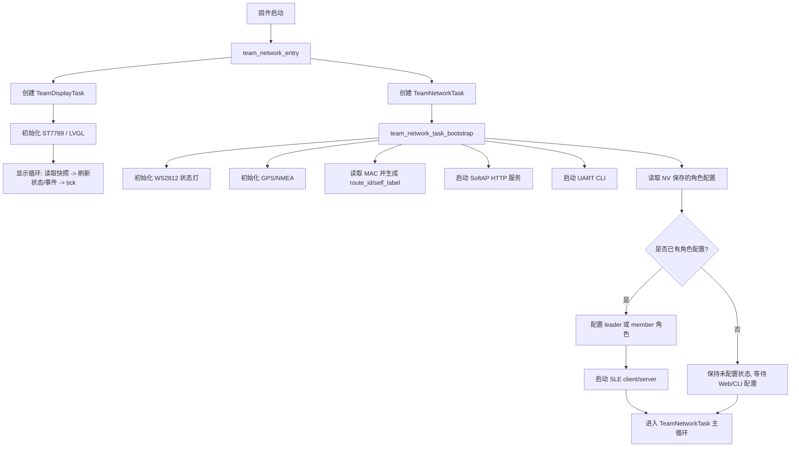
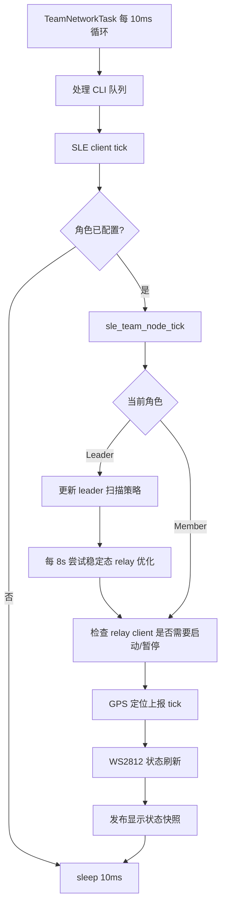
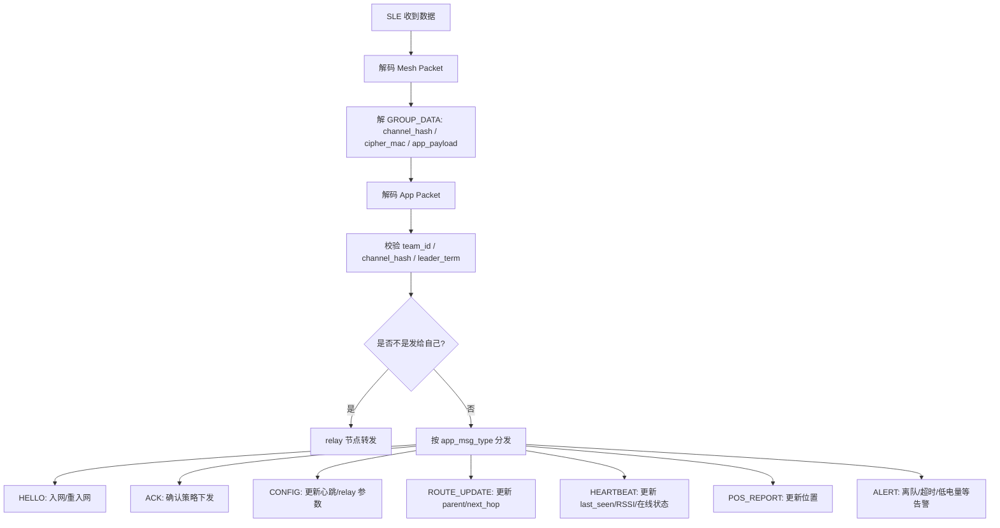
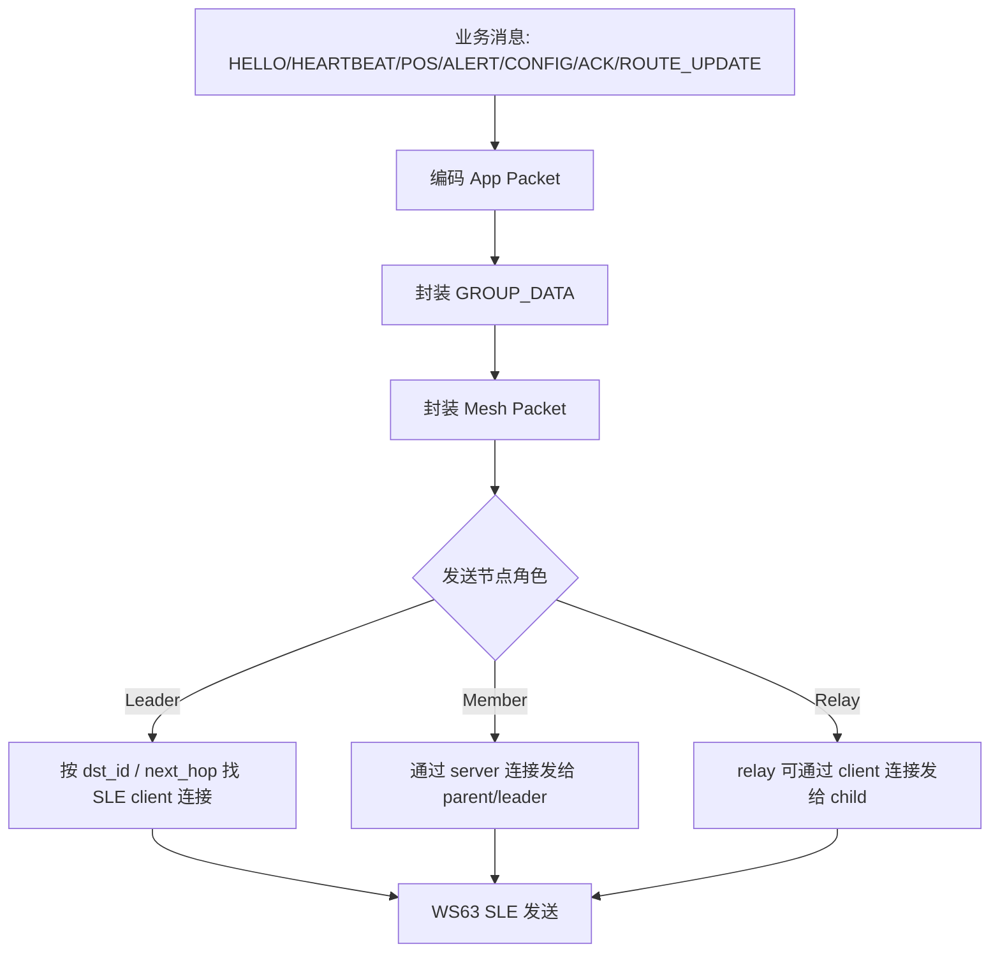
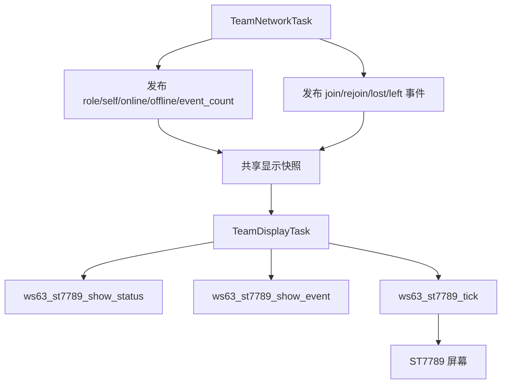

# 01 软件流程图

本节描述当前 `v4.5.46-minimal` 软件从启动到运行的主流程。系统核心由两个主要任务组成：

- `TeamNetworkTask`：负责组网、SLE 收发、HTTP、CLI、GPS、状态 LED、核心状态机 tick。
- `TeamDisplayTask`：负责 ST7789/LVGL 初始化、状态页面刷新、事件页面刷新。

## 软件启动流程

## 主循环流程

## 收包处理流程

## 发送流程

## 状态显示流程

