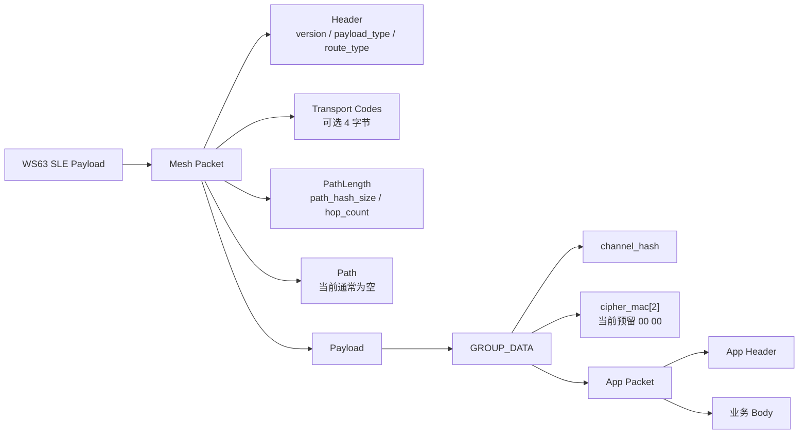

# 02 包数据帧结构图

当前系统实际传输的数据不是直接裸发业务字段，而是采用三层封装：

```text
Mesh Packet 外层
  -> GROUP_DATA wrapper
      -> App Packet 内层
          -> 业务 Body
```

当前物理传输层是 WS63 SLE。该结构可以理解为类 MeshCore/MeshLoRa 风格的数据包分层，但本工程当前不是 LoRa 空口。

## 总体数据帧结构



## 线性字节布局

```text
+------------------+-------------------------+------------------+--------------------+
| Mesh Header      | Transport Codes 可选     | PathLength       | Path               |
| 1 byte           | 0 或 4 bytes             | 1 byte           | N bytes            |
+------------------+-------------------------+------------------+--------------------+
| GROUP_DATA.channel_hash | GROUP_DATA.cipher_mac[2] | App Header | App Body        |
| 1 byte                 | 2 bytes                  | 12 bytes   | body_len bytes  |
+-------------------------+--------------------------+------------+-----------------+
```

当前常见情况下：

- `payload_type = GROUP_DATA`
- `route_type = DIRECT` 或 `FLOOD`
- `hop_count = 0`
- `Path` 通常为空
- `cipher_mac = 00 00`

因此常见实际包可简化理解为：

```text
[MeshHeader][PathLength][channel_hash][cipher_mac0][cipher_mac1][AppHeader][Body]
```

## Mesh Header 位结构

```text
Byte0: Mesh Header

bit7 bit6 | bit5 bit4 bit3 bit2 | bit1 bit0
--------- | ------------------- | ---------
version   | payload_type        | route_type
```

字段说明：

| 字段 | 长度 | 说明 |
|---|---:|---|
| `version` | 2 bit | 当前为 `SLE_TEAM_PAYLOAD_V1` |
| `payload_type` | 4 bit | 当前主要使用 `GROUP_DATA = 0x06` |
| `route_type` | 2 bit | 区分 flood/direct/transport flood/transport direct |

## route_type 类型

| 值 | 名称 | 说明 |
|---:|---|---|
| `0x00` | `TRANSPORT_FLOOD` | 带 transport code 的泛洪 |
| `0x01` | `FLOOD` | 普通泛洪 |
| `0x02` | `DIRECT` | 直达目标或下一跳 |
| `0x03` | `TRANSPORT_DIRECT` | 带 transport code 的直达 |

## payload_type 类型

| 值 | 名称 | 说明 |
|---:|---|---|
| `0x00` | `REQ` | 请求 |
| `0x01` | `RESPONSE` | 响应 |
| `0x02` | `TEXT` | 文本 |
| `0x03` | `ACK` | 外层确认 |
| `0x04` | `ADVERT` | 广播 |
| `0x05` | `GROUP_TEXT` | 组文本 |
| `0x06` | `GROUP_DATA` | 当前业务数据主要使用 |
| `0x07` | `ANON_REQ` | 匿名请求 |
| `0x08` | `PATH` | 路径 |
| `0x09` | `TRACE` | 跟踪 |
| `0x0A` | `MULTIPART` | 分片 |
| `0x0B` | `CONTROL` | 控制 |
| `0x0F` | `RAW_CUSTOM` | 自定义 |

## GROUP_DATA wrapper

```text
+-------------+---------------+----------------+
| channel_hash| cipher_mac[2] | App Packet     |
| 1 byte      | 2 bytes       | 12 + body_len  |
+-------------+---------------+----------------+
```

字段说明：

| 字段 | 长度 | 说明 |
|---|---:|---|
| `channel_hash` | 1 byte | 队伍/频道隔离，收包时必须匹配当前配置 |
| `cipher_mac` | 2 bytes | 认证/加密预留字段，当前通常为 `00 00` |
| `App Packet` | 可变 | 组网业务消息 |

## App Packet 结构

```text
+--------------+-------+-----+---------+--------+--------+-----+-------------+----------+------+
| app_msg_type | flags | seq | team_id | src_id | dst_id | ttl | leader_term | body_len | body |
| 1 byte       |1 byte |2 LE | 1 byte  | 1 byte | 1 byte |1    | 2 LE        | 2 LE     | N    |
+--------------+-------+-----+---------+--------+--------+-----+-------------+----------+------+
```

字段说明：

| 字段 | 长度 | 说明 |
|---|---:|---|
| `app_msg_type` | 1 byte | 业务消息类型 |
| `flags` | 1 byte | 业务标志位，当前大多为 0 |
| `seq` | 2 bytes LE | 发送序号 |
| `team_id` | 1 byte | 队伍 ID |
| `src_id` | 1 byte | 源节点 route id |
| `dst_id` | 1 byte | 目标节点 route id，`0xFF` 表示广播 |
| `ttl` | 1 byte | 转发跳数限制 |
| `leader_term` | 2 bytes LE | leader 代次，避免旧 leader/旧策略污染 |
| `body_len` | 2 bytes LE | Body 长度 |
| `body` | 可变 | 业务消息体 |

## App 消息类型

| 值 | 名称 | 用途 |
|---:|---|---|
| `0x01` | `HELLO` | member 入网、重入网、身份上报 |
| `0x02` | `HEARTBEAT` | 在线心跳、电量、RSSI、定位状态 |
| `0x03` | `POS_REPORT` | 经纬度、速度、航向、卫星数 |
| `0x04` | `ALERT` | 离队、超时、距离、电量等告警 |
| `0x05` | `CONFIG` | leader 下发心跳、距离、relay 参数 |
| `0x06` | `ACK` | 确认 HELLO/CONFIG/ROUTE_UPDATE |
| `0x07` | `ROUTE_UPDATE` | leader 下发 parent/next_hop/relay 策略 |

## 业务 Body 结构

### HELLO Body

```text
+-----------+------+---------+--------+-----------+----------------+
| device_id | role | battery | mac[6] | mac_ready | fw_compat[2]   |
| 1 byte    |1 byte| 1 byte  |6 bytes | 1 byte    | low, high      |
+-----------+------+---------+--------+-----------+----------------+
```

用途：

- member 告诉 leader 自己是谁。
- 携带固件兼容指纹 `fw_compat`。
- leader 用它判断是否允许入队。

### HEARTBEAT Body

```text
+---------+----------+------------+----------+
| battery | rssi_dbm | fix_status | reserved |
| 1 byte  | 1 byte   | 1 byte     | 1 byte   |
+---------+----------+------------+----------+
```

用途：

- 周期证明节点在线。
- 更新 leader 成员表中的 `last_seen_s`、RSSI、定位状态。

### POS_REPORT Body

```text
+-------------+--------------+-----------+-------------+---------+------------+-----------+----------+
| latitude_e6 | longitude_e6 | speed_cms | heading_deg | battery | fix_status | sat_count | reserved |
| int32 LE    | int32 LE     | uint16 LE | uint16 LE   | 1 byte  | 1 byte     | 1 byte    | 1 byte   |
+-------------+--------------+-----------+-------------+---------+------------+-----------+----------+
```

用途：

- 上报 GPS 或手机位置。
- leader 更新成员位置表。

### ALERT Body

```text
+----------------+--------+----------+------------------+-------------------+---------------+
| lost_member_id | reason | reserved | last_latitude_e6 | last_longitude_e6 | last_report_s |
| 1 byte         |1 byte  | uint16   | int32 LE         | int32 LE          | uint32 LE     |
+----------------+--------+----------+------------------+-------------------+---------------+
```

用途：

- 上报离队、超时、低电量、距离告警。
- 显式 leave 时使用 `SLE_TEAM_ALERT_LEAVE`。

### CONFIG Body

```text
+-------------------+-----------------+-----------------+---------------------+
| report_interval_s | warn_distance_m | lost_distance_m | heartbeat_timeout_s |
| uint16 LE         | uint16 LE       | uint16 LE       | uint16 LE           |
+-------------------+-----------------+-----------------+---------------------+
| relay_allowed     | relay_tier      | max_downstream  | reserved            |
| 1 byte            | 1 byte          | 1 byte          | 1 byte              |
+-------------------+-----------------+-----------------+---------------------+
```

用途：

- leader 给 member 下发心跳、位置上报、距离阈值和 relay 能力。

### ACK Body

```text
+---------+----------------+-------------+
| ack_seq | acked_msg_type | status_code |
| 2 LE    | 1 byte         | 1 byte      |
+---------+----------------+-------------+
```

用途：

- member 确认收到 `ROUTE_UPDATE`、`CONFIG` 或 `HELLO` 相关策略。
- leader 用 ACK 把 `policy_pending` 清掉并确认 member online。

### ROUTE_UPDATE Body

```text
+-----------+-------------+--------------+----------+
| parent_id | next_hop_id | parent_state | reserved |
| 1 byte    | 1 byte      | 1 byte       | 1 byte   |
+-----------+-------------+--------------+----------+
```

用途：

- leader 告诉 member 当前应该挂在哪个 parent 下。
- `next_hop_id` 指明实际下一跳。
- `reserved bit0` 表示 relay 授权同步。

## 典型 HEARTBEAT 包示例

```text
Mesh Packet
  version      = 0
  payload_type = GROUP_DATA
  route_type   = DIRECT
  hop_count    = 0

GROUP_DATA
  channel_hash = 当前队伍频道
  cipher_mac   = 00 00

App Packet
  app_msg_type = HEARTBEAT
  seq          = 当前序号
  team_id      = 队伍 ID
  src_id       = member route id
  dst_id       = leader route id
  ttl          = 4
  leader_term  = 当前 leader 代次
  body_len     = 4

Body
  battery_percent
  rssi_dbm
  fix_status
  reserved
```

## 设计意义

该数据帧结构把传输层和业务层分开：

- Mesh Packet 负责外层路由类型和路径扩展。
- GROUP_DATA 负责频道隔离和后续安全字段预留。
- App Packet 负责组网业务语义。
- Body 只关心具体业务内容。

因此后续如果从 WS63 SLE 迁移到 LoRa，只需要替换底层收发驱动，上层 App Packet 和大部分组网状态机可以复用。

