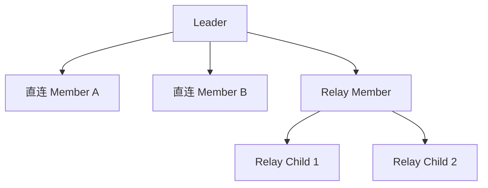
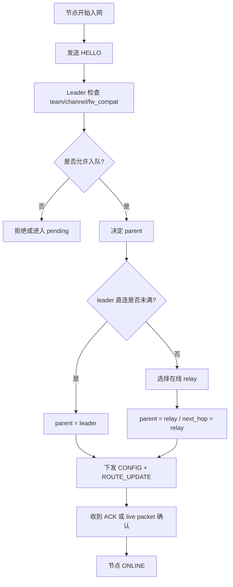

# 03 组网结构图

本节描述当前系统的正常组网结构。系统采用 leader 集中式组网，leader 持有成员表并统一分配拓扑。

## 正常拓扑

## 组网角色

| 角色 | 职责 |
|---|---|
| Leader | 维护成员表、扫描入网、分配 parent/next_hop、下发 CONFIG/ROUTE_UPDATE、处理掉线恢复 |
| Member | 向 leader 发 HELLO/HEARTBEAT/POS，按 leader 指令工作 |
| Relay Member | 既是 member 又是 child 转发节点，承担下游连接 |
| Relay Child | 挂在 relay 下面的普通成员 |

## 组网规则

## 直连容量

当前逻辑中 leader 默认直连容量为 7，见 [sle_team_node.c](E:/codex_documents/sle/src/sle_team_node.c:4)。当直连数达到上限时，leader 会优先选择一个在线且允许 relay 的成员升级为 relay，再把后续成员挂到该 relay 下。

## 版本隔离

每个 HELLO 都携带 `fw_compat`，leader 在处理入网时会校验兼容指纹。这样不同 proof line 的固件不会在同一队伍里混连。

## 任务边界

- `TeamNetworkTask` 负责组网决策和成员表更新。
- `TeamDisplayTask` 只负责展示，不参与组网。
- HTTP 和串口只是控制入口，不改变组网原则。

