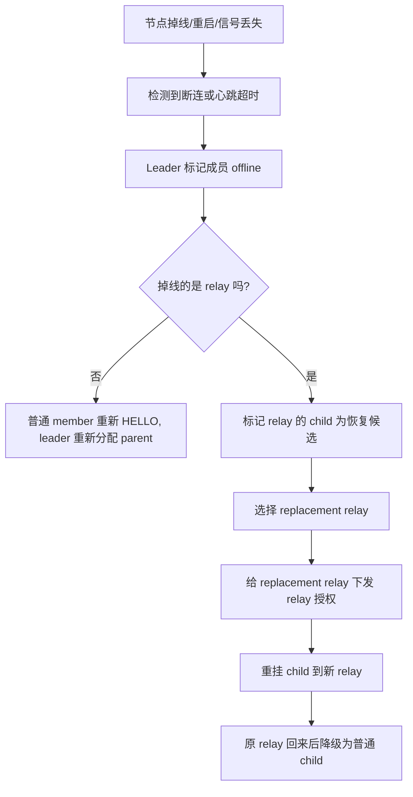
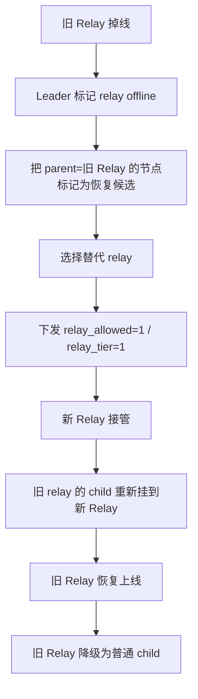
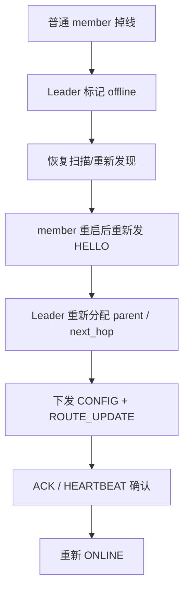

# 04 自恢复网络结构图

本节描述节点掉线后的自恢复机制。当前系统不是全网重建，而是局部修复受影响的拓扑分支。

## 自恢复总流程

## relay 掉线恢复结构

## 普通 member 掉线恢复

## 代码中的关键机制

| 机制 | 作用 |
|---|---|
| `sle_team_mark_member_offline()` | 将成员标记为离线，并处理 relay 相关的下游恢复 |
| `sle_team_mark_relay_children_offline()` | relay 掉线时把它的 child 转成恢复候选 |
| `sle_team_assign_parent()` | 决定 member 当前应该挂到 leader 还是 relay |
| `sle_team_handle_hello()` | 节点回来后重新入网和重新下发策略 |
| `sle_team_handle_heartbeat()` | 用心跳更新在线状态并完成恢复确认 |
| `team_leader_drop_stale_direct_conn()` | 清理旧直连残留，防止恢复中拓扑污染 |

## 自恢复原则

1. 只修复受影响分支，不全网重组。
2. 以 leader 为唯一拓扑裁决点。
3. 新策略优先生效，旧连接必须被清理。
4. relay 恢复后默认先降级为普通 child，避免重复抢占拓扑。
5. 通过 ACK、HEARTBEAT、位置包共同确认在线，而不是只靠单一事件。

## 适合文档中的一句话

> 本系统的自恢复组网采用 leader 集中式局部修复策略：当普通 member 掉线时重新分配 parent，当 relay 掉线时只重构其下游分支，并通过 `ROUTE_UPDATE`、`CONFIG`、`ACK` 和心跳包共同完成恢复确认。

