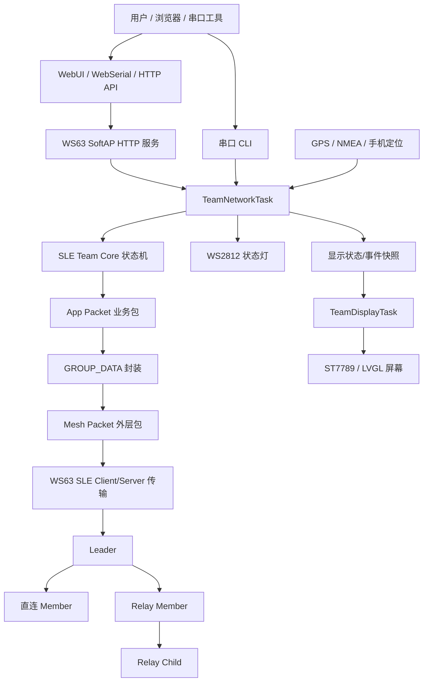

# WS63 SLE Mesh 软件技术文档图集

本文档集基于当前工程最新源码版本 `v4.5.46-minimal` 编写。该版本的固件兼容指纹为 `0x0546U`，当前实际传输层为 WS63 SLE，不是 LoRa；但上层采用了 Mesh Packet + GROUP_DATA + App Packet 的分层数据帧结构。

## 文档目录

| 文档 | 内容 |
|---|---|
| [01_软件流程图.md](./01_软件流程图.md) | 软件启动、运行任务、组网消息处理、显示刷新整体流程 |
| [02_包数据帧结构图.md](./02_包数据帧结构图.md) | 当前实际传输的数据包分层、字段结构、业务消息体 |
| [03_组网结构图.md](./03_组网结构图.md) | leader、member、relay、child 的网络结构和入网流程 |
| [04_自恢复网络结构图.md](./04_自恢复网络结构图.md) | 普通节点掉线恢复、relay 掉线恢复、旧连接清理机制 |

## 当前软件版本

```text
Firmware Version: v4.5.46-minimal
Firmware Compat : 0x0546
Transport       : WS63 SLE
Web/API         : WS63 SoftAP HTTP + WebSerial
Display         : ST7789 + LVGL + TeamDisplayTask
Status LED      : WS2812
```

## 总体架构



## 核心说明

系统采用 leader 集中式组网。leader 负责成员准入、拓扑分配、relay 授权、掉线检测和恢复策略下发；member 根据 leader 下发的 `CONFIG` 和 `ROUTE_UPDATE` 调整自己的 parent 和 next hop。

当前 v4.5.46 的一个重要改动是显示任务隔离：`TeamNetworkTask` 负责组网、HTTP、CLI、GPS、LED 和状态机 tick；`TeamDisplayTask` 独立负责 ST7789/LVGL 初始化、页面绘制和周期刷新。这样可以避免屏幕刷新影响 SLE 组网回调。

