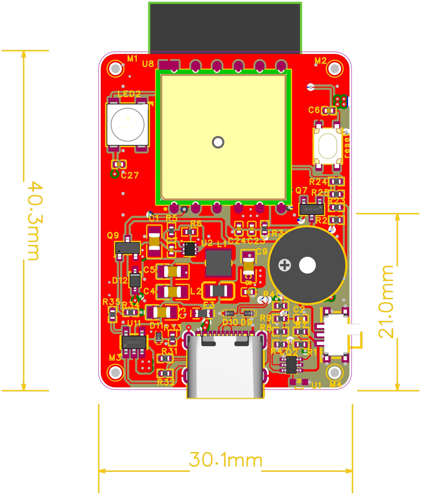
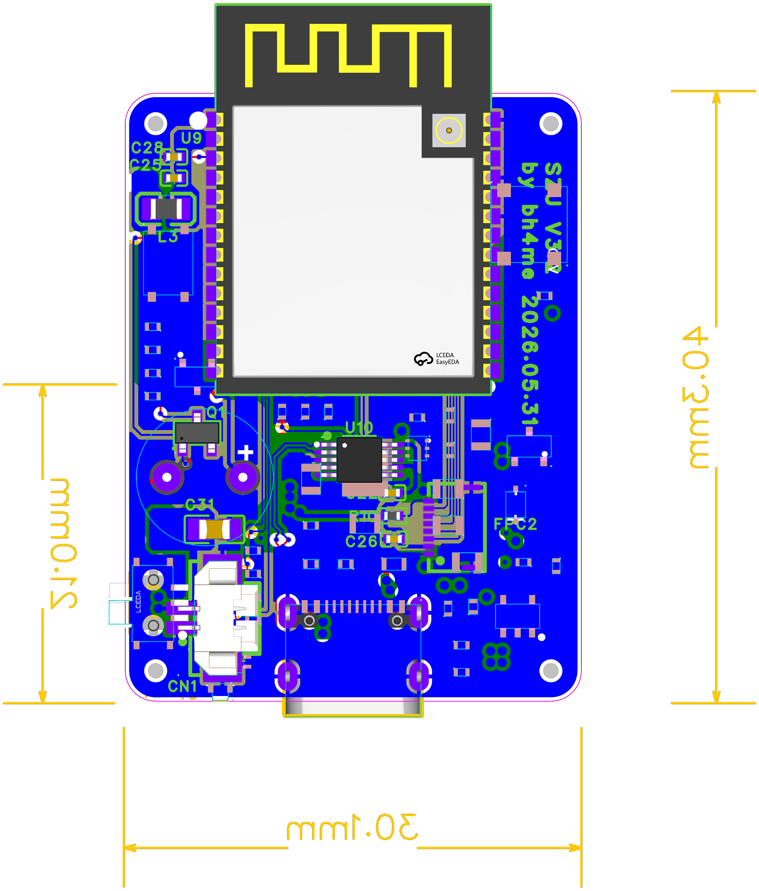

# SLE Main Board PCB v3.3

该目录保存 2026-06-16 导出的 SLE 主板 PCB 资料和板卡预览图，用于硬件结构确认、尺寸核对和后续制板资料归档。

## 文件

- [PCB_PCB1_3_2026-06-16.pdf](PCB_PCB1_3_2026-06-16.pdf)：PCB 导出 PDF。
- [preview/layout_render_1.png](preview/layout_render_1.png)：板卡预览图 1。
- [preview/layout_render_2.png](preview/layout_render_2.png)：板卡预览图 2。
- [MANIFEST.md](MANIFEST.md)：文件清单和来源说明。

## 预览

## 备注

- 预览图标注的外形尺寸约为 30.1 mm x 40.3 mm。
- 当前归档内容包含 PCB PDF 和预览图；Gerber、BOM、坐标文件和装配说明如后续确认，应继续放入本版本目录下的独立子目录。
