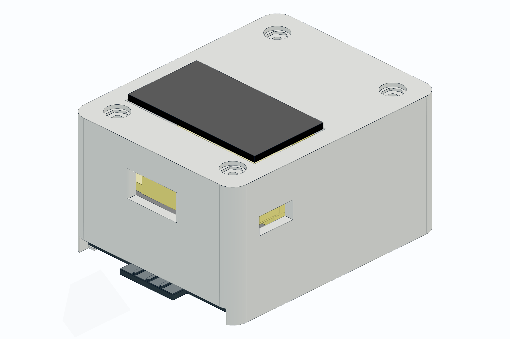

# SLE PCB Enclosure v1.1.4

## 版本摘要

- 移除 GPS 区域上方的贯穿窗口。
- GPS 区域改为 0.8 mm 薄顶皮，外观封闭，同时给天线区域保留较薄材料。
- 显示窗口到 GPS 区域之间保留约 2.05 mm 连接桥。
- 继承 v1.1.3 的可打印配合改进：PCB/屏幕间隙加宽、电池高度降低、滑盖加厚、顶部螺丝孔和 M1 螺母/沉孔扩大。

## 可打印文件

- [stl/sle_enclosure_v1.1.4_one_piece_shell.stl](stl/sle_enclosure_v1.1.4_one_piece_shell.stl)
- [stl/sle_enclosure_v1.1.4_battery_slide_cover.stl](stl/sle_enclosure_v1.1.4_battery_slide_cover.stl)

## STEP 文件

- [step/sle_enclosure_v1.1.4_one_piece_shell.step](step/sle_enclosure_v1.1.4_one_piece_shell.step)
- [step/sle_enclosure_v1.1.4_battery_slide_cover.step](step/sle_enclosure_v1.1.4_battery_slide_cover.step)
- [step/sle_enclosure_v1.1.4_preview.step](step/sle_enclosure_v1.1.4_preview.step)

## 预览

## 验证记录

- 一体式外壳 STL 包围盒：36.6 x 46.6 x 25.35 mm。
- 电池滑盖 STL 包围盒：32.7 x 45.25 x 1.55 mm。
- 一体式外壳 STL：watertight，winding consistent，1 component。
- 电池滑盖 STL：watertight，winding consistent，1 component。
- STEP 检查通过：preview assembly、one-piece shell、battery slide cover。

## 源文件

- [source/sle_enclosure_v1.1.4_source.py](source/sle_enclosure_v1.1.4_source.py)
